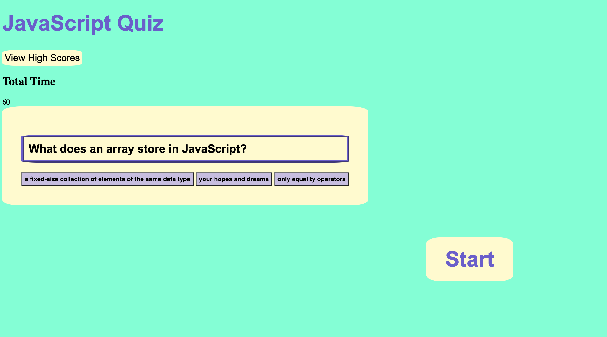

# JavaScript-Code-Quiz

## Description

This project generates timed quiz on JavaScript fundamentals that stores high scores
so that the user can compare their progress with other players. When the user answers incorrectly, the time will decrease by 15 seconds.

## Instalation

- Clone with repository: https://github.com/gjferrari/password-generator
  - git clone: git@github.com:gjferrari/password-generator.git
- Open Repo with VS Code or IDE of your choice
- Open Index.html with Live Server to inspect Code or visit: https://gjferrari.github.io/password-generator/

## Mock-Up

- The followings image shows the web application's appearance and functionality:

## Liscense

Please refer to the LICENSE in the repo
